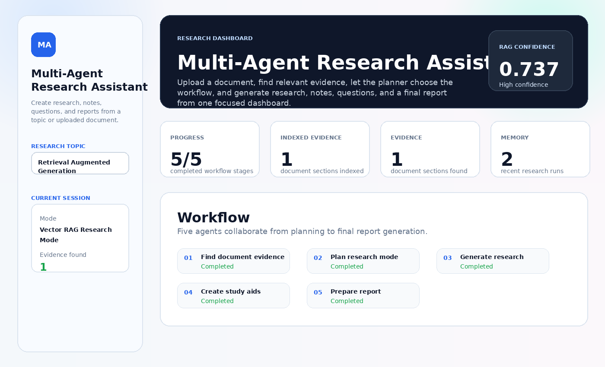
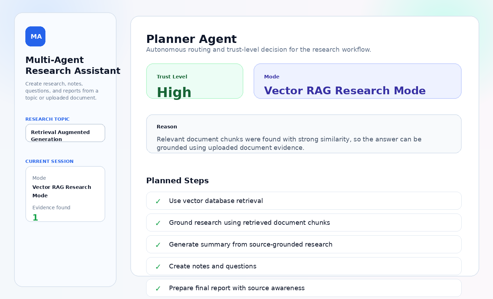
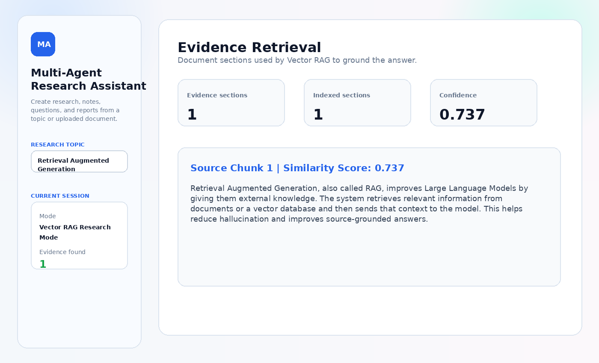
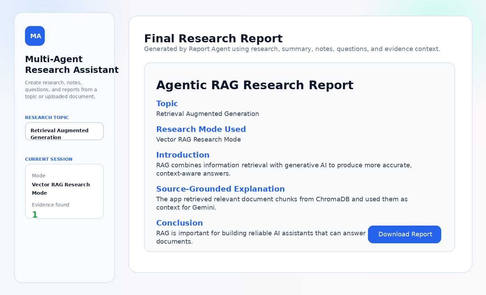
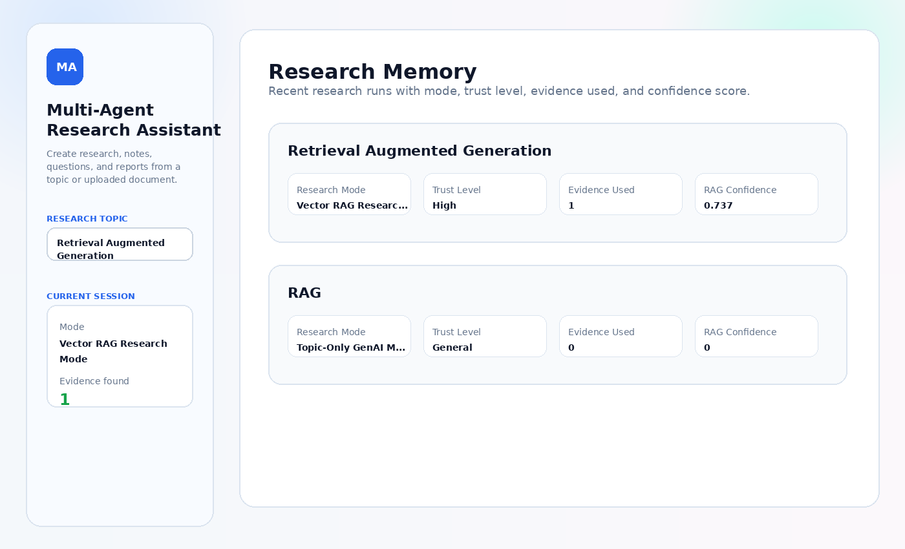

# Multi-Agent Research Assistant

Multi-Agent Research Assistant is an advanced **Agentic RAG** application that helps users research a topic from uploaded PDF/TXT documents. It retrieves source-grounded evidence, lets an autonomous planner choose the research mode, and generates research explanations, summaries, notes, questions, and final reports using Gemini AI.

## Live Demo

Add your Streamlit Cloud link here after deployment.

## Project Overview

This project uses a multi-agent workflow to automate research. The user enters a topic and uploads a document. The app extracts document text, splits it into chunks, stores document chunks in ChromaDB, generates Gemini embeddings, retrieves relevant evidence, and then runs multiple AI agents to create a complete research output.

## Screenshots

### Dashboard



### Planner Agent



### Evidence Retrieval



### Final Report



### Research Memory



## Features

- PDF and TXT document upload
- Document text extraction
- Document chunking
- ChromaDB vector database
- Gemini embedding-based semantic retrieval
- Vector RAG research mode
- Topic-only GenAI fallback mode
- Autonomous planner agent
- Source-grounded research generation
- RAG confidence score
- Trust-level detection
- Agent memory
- Summary generation
- Study notes generation
- Practice question generation
- Final downloadable research report
- Professional Streamlit dashboard UI

## AI Agents Used

- **Planner Agent** — chooses the research mode and trust level
- **Vector RAG Agent** — retrieves relevant document evidence
- **Research Agent** — creates source-grounded explanation
- **Summary Agent** — summarizes the research
- **Notes Agent** — creates student-friendly notes
- **Question Agent** — generates practice and interview questions
- **Report Agent** — creates the final structured research report

## How It Works

```text
User enters research topic
↓
User uploads PDF/TXT document
↓
App extracts document text
↓
Text is split into chunks
↓
Gemini creates embeddings
↓
ChromaDB stores and searches document vectors
↓
Relevant evidence is retrieved
↓
Planner Agent decides research mode
↓
AI agents generate research, notes, questions, and report
↓
User downloads final report
```

## Tech Stack

- Python
- Streamlit
- Gemini API
- Gemini Embeddings
- ChromaDB
- PDFPlumber
- NumPy
- Python-dotenv
- Git & GitHub
- Streamlit Cloud

## Project Structure

```text
Multi-Agent-Research-Assistant/
│
├── app.py
├── requirements.txt
├── README.md
├── .gitignore
│
├── utils/
│   ├── agents.py
│   ├── agent_planner.py
│   ├── document_reader.py
│   └── vector_store.py
│
└── screenshots/
    ├── dashboard.png
    ├── planner.png
    ├── evidence.png
    ├── report.png
    └── memory.png
```

## Installation

Clone the repository:

```bash
git clone https://github.com/joicyroslin-svg/Multi-Agent-Research-Assistant.git
```

Move into the project folder:

```bash
cd Multi-Agent-Research-Assistant
```

Create a virtual environment:

```bash
python -m venv .venv
```

Activate the virtual environment:

```bash
.venv\Scripts\activate
```

Install dependencies:

```bash
pip install -r requirements.txt
```

Run the Streamlit app:

```bash
python -m streamlit run app.py
```

## Environment Variables

Create a `.env` file in the project root:

```env
GEMINI_API_KEY=your_gemini_api_key_here
```

Do not upload the `.env` file to GitHub.

## Streamlit Deployment

When deploying on Streamlit Cloud, add this in **Secrets**:

```toml
GEMINI_API_KEY = "your_real_gemini_api_key_here"
```

## Sample Test

Use this test case:

```text
Research Topic: Retrieval Augmented Generation
Upload File: sample_agentic_rag_test_document.pdf
Source Sections: 4
```

Expected output:

```text
Mode: Vector RAG Research Mode
Trust Level: High
RAG Confidence: Above 0.70
Workflow Progress: 5/5 completed
Final Report: Generated successfully
```

## Resume Description

Built an advanced Agentic RAG Research Assistant using Gemini API, ChromaDB, vector embeddings, and Streamlit, featuring autonomous agent planning, document-based retrieval, source-grounded research generation, agent memory, confidence scoring, and a professional dashboard UI.

## Live Demo

[Try the App](https://multi-agent-research-assistant-ai.streamlit.app/)

## Author

Joicy Roslin

GitHub: https://github.com/joicyroslin-svg
